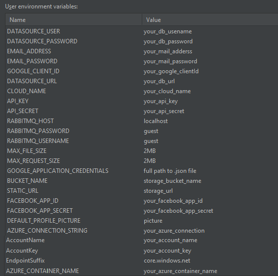
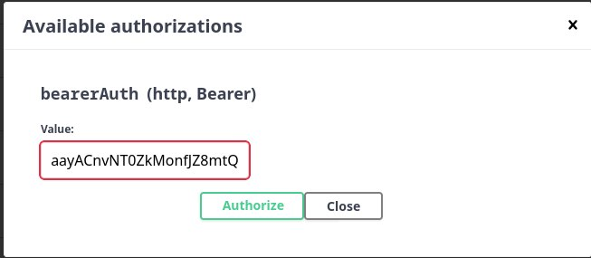

<a href="https://career.softserveinc.com/en-us/technology/course/start_your_career_as_java_developer/"></a>


# GreenCity    [](https://github.com/ita-social-projects/GreenCity/blob/master/LICENSE) [](https://github.com/ita-social-projects/GreenCity/releases/) [](https://travis-ci.com/ita-social-projects/GreenCity) [](https://sonarcloud.io/dashboard?id=ita-social-projects-green-city) [](https://github.com/ita-social-projects/GreenCity/issues) [](https://github.com/ita-social-projects/GreenCity/pulls)

**Copyright 2020 Softserve IT Academy**

Permission is hereby granted, free of charge, to any person obtaining a copy of this software and associated documentation files (the "Software"), to deal in the Software without restriction, including without limitation the rights to use, copy, modify, merge, publish, distribute, sublicense, and/or sell copies of the Software, and to permit persons to whom the Software is furnished to do so, subject to the following conditions:

The above copyright notice and this permission notice shall be included in all copies or substantial portions of the Software.

THE SOFTWARE IS PROVIDED "AS IS", WITHOUT WARRANTY OF ANY KIND, EXPRESS OR IMPLIED, INCLUDING BUT NOT LIMITED TO THE WARRANTIES OF MERCHANTABILITY, FITNESS FOR A PARTICULAR PURPOSE AND NONINFINGEMENT. IN NO EVENT SHALL THE AUTHORS OR COPYRIGHT HOLDERS BE LIABLE FOR ANY CLAIM, DAMAGES OR OTHER LIABILITY, WHETHER IN AN ACTION OF CONTRACT, TORT OR OTHERWISE, ARISING FROM, OUT OF OR IN CONNECTION WITH THE SOFTWARE OR THE USE OR OTHER DEALINGS IN THE SOFTWARE.


## 1. About the project

The main aim of “GreenCity” project is to teach people in a playful and challenging way to have an eco-friendly lifestyle. A user can view on the map places that have some eco-initiatives or suggest discounts for being environmentally aware (for instance, coffee shops that give a discount if a customer comes with their own cup). А user can start doing an environment-friendly habit and track their progress with a habit tracker.

## 2. Where to find front-end part of the project

Here is the front-end part of our project: https://github.com/ita-social-projects/GreenCityClient.

`dev` branch of the back-end corresponds to `dev` branch on the front-end. The same thing with `master` branches.

## 3. How to contribute

You're encouraged to contribute to our project if you've found any issues or missing functionality that you would want to see. Here you can see [the list of issues](https://github.com/ita-social-projects/GreenCity/issues) and here you can create [a new issue](https://github.com/ita-social-projects/GreenCity/issues/new).

Before sending any pull request, please discuss requirements/changes to be implemented using an existing issue or by creating a new one. All pull requests should be done into `dev` branch.

Though there are two GitHub projects ([GreenCity](https://github.com/ita-social-projects/GreenCity) for back-end part and [GreenCityClient](https://github.com/ita-social-projects/GreenCityClient) for front-end part) all of the issues are listed in the first one - [GreenCity](https://github.com/ita-social-projects/GreenCity).

**NOTE: make sure that your code passes checkstyle. Otherwise your pull request will be declined**. See paragraph [Setup Checkstyle](#5-setup-checkstyle).

## 4. Start the project locally

### 4.1. Required to install

* Java 21
* PostgreSQL 9.5 or higher

### 4.2. How to run

1. You should open in IntelliJ IDEA File -> `New Project` -> `Project From Version Control`
   -> `Repository URL` -> `URL` (https://github.com/ita-social-projects/GreenCity.git) -> `Clone`.


2. Open `Terminal` write `git checkout -b dev` (this will create new local branch "dev").


3. After this `git pull origin dev` (for update last version from branch dev)


4. You should create database `greencity`.


5. `Add Configuration` -> `+` -> `Application`.

* `Name` : `GreenCityApplication`.
* `Use classpath of modules`:`core`
* `JRE` : `21`.

6. `Enviroment variables`:



7. Go to `dao` -> `src` -> `test` -> `resources` -> `sql`, find file `insert.sql`,
   open it, press `Ctrl + A` -> `RMB` -> `Execute`. (that will run script which fill your db)


8. `Run Application`


9. If you did everything correctly, you should be able to access swagger by this URL: http://localhost:8080/swagger-ui.html#/

### 4.3. How to work with Swagger UI in our project

> [!IMPORTANT]
> The user authentication and authorization logic 
> is contained in separate project, GreenCityUser.
> You will need to clone it as well to get going with GreenCity.
>
> ```git clone https://github.com/ita-social-projects/GreenCityUser.git```

> [!WARNING]
> Endpoints are subject to change, so if you cannot
> find some of the specified below, please contact
> project members.

1. Create database called "greencity". Here's example with Docker CLI:
```shell
docker run -d --name greencity_postgres -p 5432:5432 -e POSTGRES_PASSWORD=postgres -e POSTGRES_DB="greencity" -e POSTGRES_USER="greencity_admin" docker.io/postgres
```
2. Run GreenCityUser project with all necessary environment variables in place.
> [!NOTE]
> If you start your project locally, don't forget to change DATASOURCE_URL 
> environment variable so that it points to localhost:5432.
3. Navigate to localhost:8060/swagger-ui.html.
4. Find "own-security controller" tab, open it.
5. find POST /ownSecurity/signUp endpoint.
6. Register user and click "Execute". The example of user data can be seen above

7. Change your status in the database to activated, using command
`UPDATE users SET user_status = 2 WHERE id = <your_user_id>;`.
Also, you will need to delete the email verification record.
This is done with the following SQL statement:
`DELETE FROM verify_emails WHERE user_id = <your_user_id>;`
7. Navigate to /ownSecurity/signIn endpoint and input your data. 
You will need to enter captcha code,
you can generate one [here](https://gc-captcha-generator-2.pages.dev).
8. When you log in, you will receive similar output to the one above. 
Copy accessToken and proceed to GreenCity Swagger web interface.

9. Press authorize, input access token and you're done! 
On successful login, you will see "authorized" text.


10. Now you can use swagger UI to test REST API. 
Some controllers require *ADMIN* role. 
By default, new registered users have role *USER*. 
To overcome this you need to update record that corresponds 
to your user in the local database. 
For example, `UPDATE users SET role = 1 WHERE id = <your_user_id>;`.

### 4.4. Connect with front-end

There is no special configurations required. Just clone [GreenCityClient](https://github.com/ita-social-projects/GreenCityClient) and run it. If you want to sign in with Google account, it's mandatory to set `google.clientId`. Read more about how to obtain [Google client id](https://developers.google.com/adwords/api/docs/guides/authentication), it's free.

## 5. Setup Checkstyle

Here you can read more about [how to set up checkstyle](https://github.com/ita-social-projects/GreenCity/wiki/Setup-CheckStyle-to-your-IDE);

Here you can read more about [SonarLint](https://plugins.jetbrains.com/plugin/7973-sonarlint);
